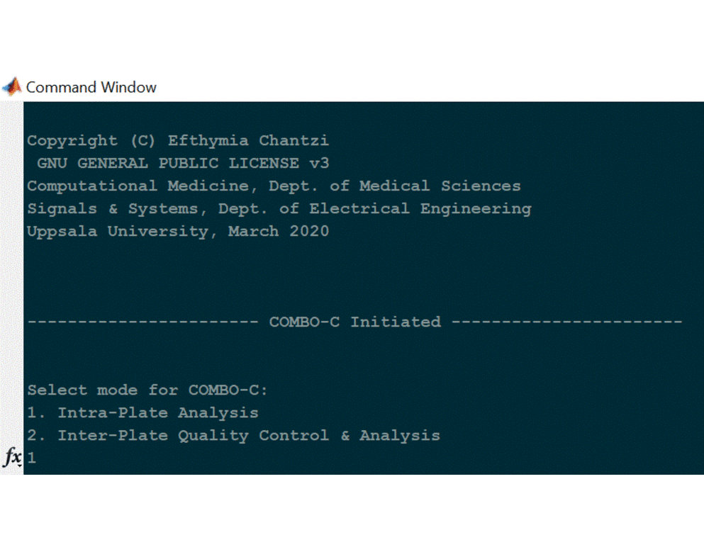
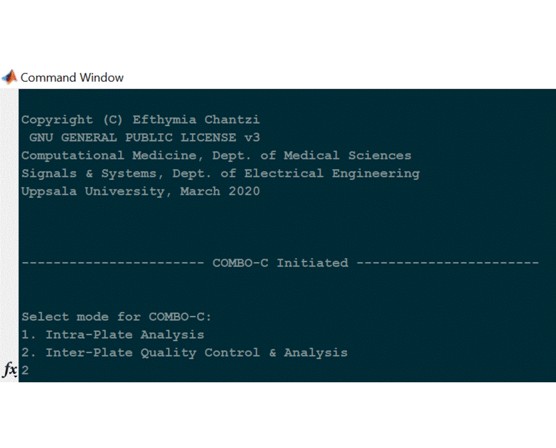

# COMBO-C

COMBO-C is provided as a command line tool that can be deployed as a 
standalone executable on Windows machines. Download and install the
Windows version of MATLAB Runtime for R2019b from the following link:

https://www.mathworks.com/products/compiler/mcr/index.html

## Intra-plate analysis

The following short animation shows how to deploy the computational
module COMBO-C, in order to perform intra-plate analysis and visualization.

## Inter-plate analysis

The following short animation shows how to deploy the computational 
module COMBO-C, in order to perform inter-plate analysis. This involves
quality control of the replicate results among the different plates,
calculation of the corresponding median values to reduce experimental 
noise/variability and joint visualization.

