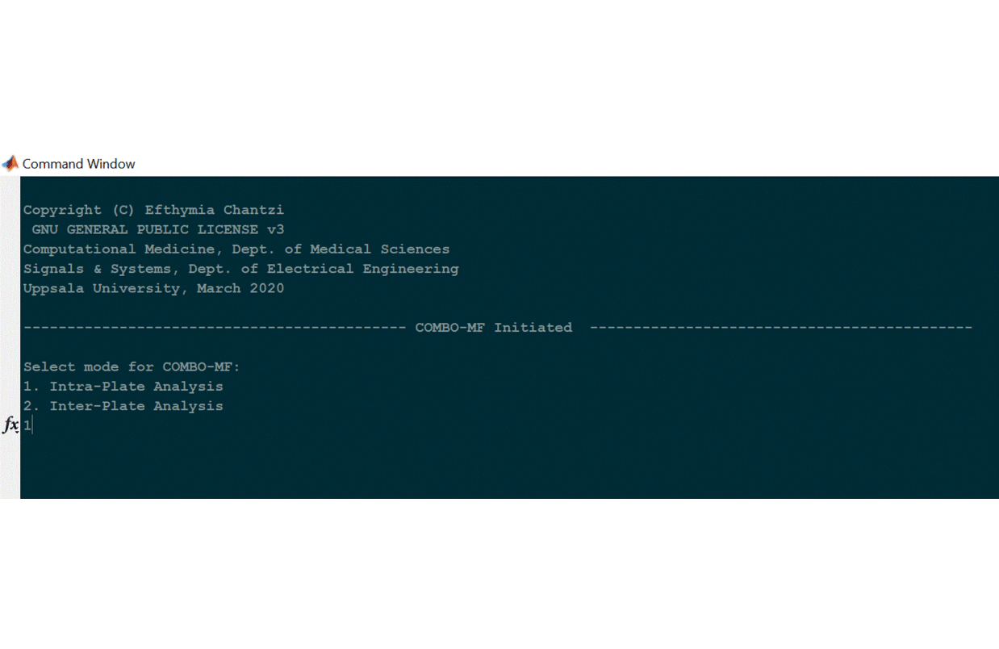
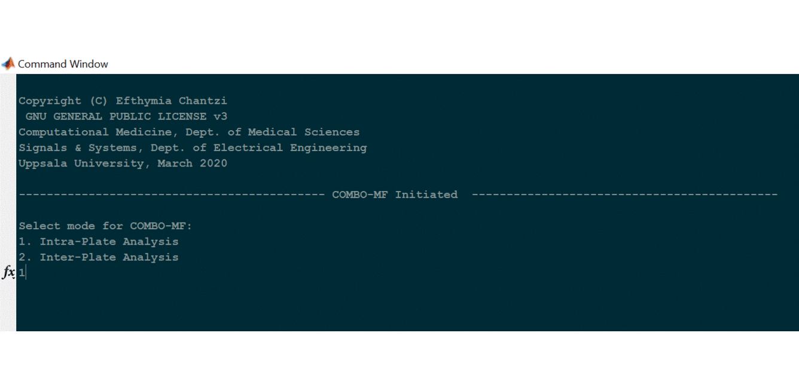
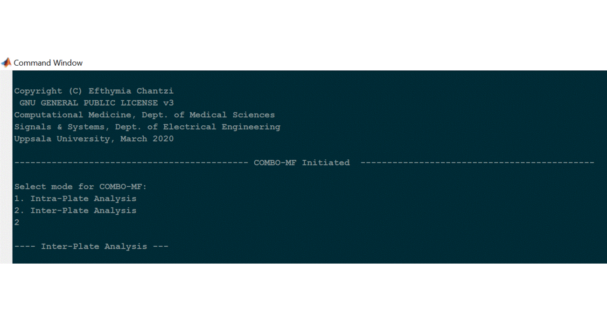

# COMBO-MF

COMBO-MF is provided as a command line tool that can be deployed as a 
standalone executable on Windows machines. Download and install the
Windows version of MATLAB Runtime for R2019b from the following link:

https://www.mathworks.com/products/compiler/mcr/index.html

## Intra-plate analysis

- One prototype 

The following short animation shows how to deploy the computational
module COMBO-MF, in order to perform intra-plate analysis using one
prototypic object, manually extracted from the phase-contrast image
libraries.

- Merge results from all prototypes

The following short animation shows how to deploy the computational 
module COMBO-MF, in order to merge all intra-plate analyses results
from all different prototypes.

## Inter-plate analysis

The following short animation shows how to deploy the computational 
module COMBO-MF, in order to perform inter-plate analysis, meaning 
to merge and visualize the results obtained for all replicate
plates/batches.

