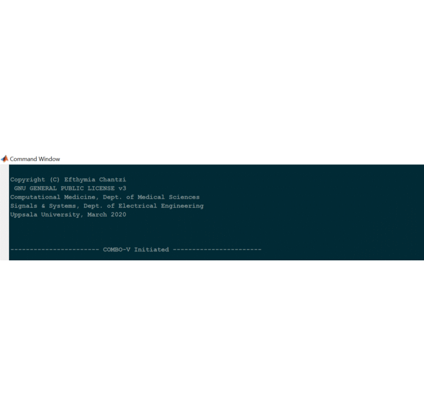

# COMBO-V

COMBO-V is provided as a command line tool that can be deployed as a 
standalone executable on Windows machines. Download and install the
Windows version of MATLAB Runtime for R2019b from the following link:

https://www.mathworks.com/products/compiler/mcr/index.html

The following short animation shows how to deploy the computational 
module COMBO-V, in order to perform intra- and inter-plate analyses,
including cell viability analysis  and visualization per experimental 
plate, as well as quality control of the  replicate results among the
different plates, calculation of the corresponding median values to
reduce experimental noise/variability and joint visualization.

