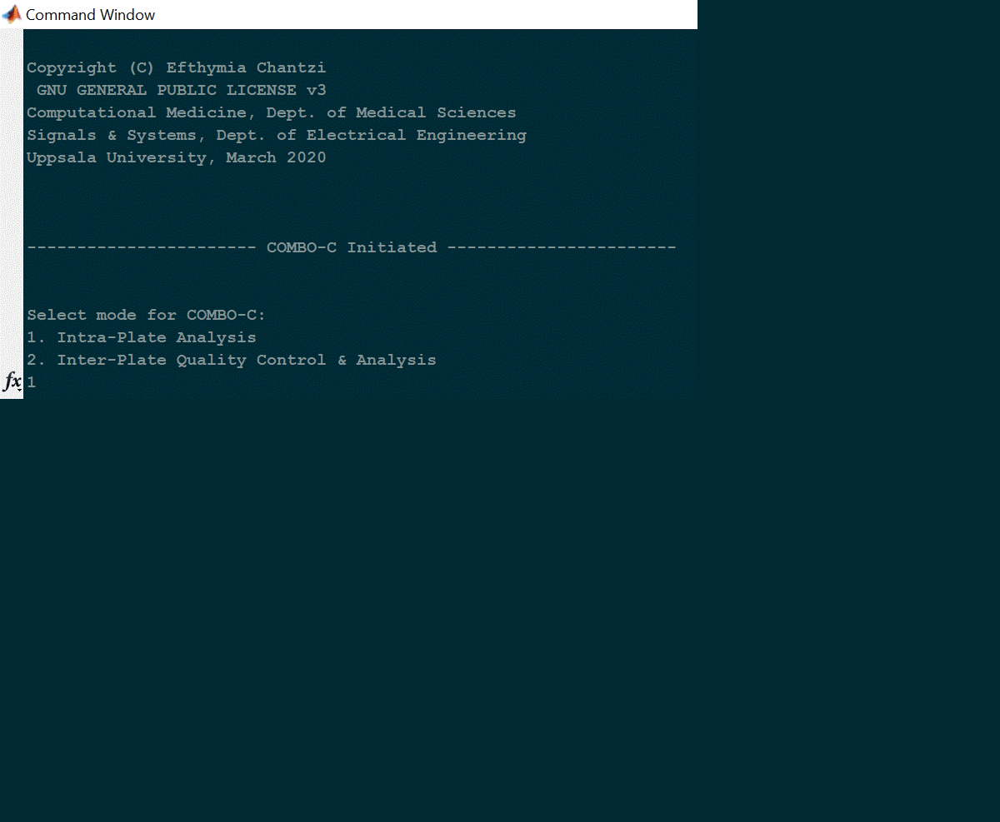
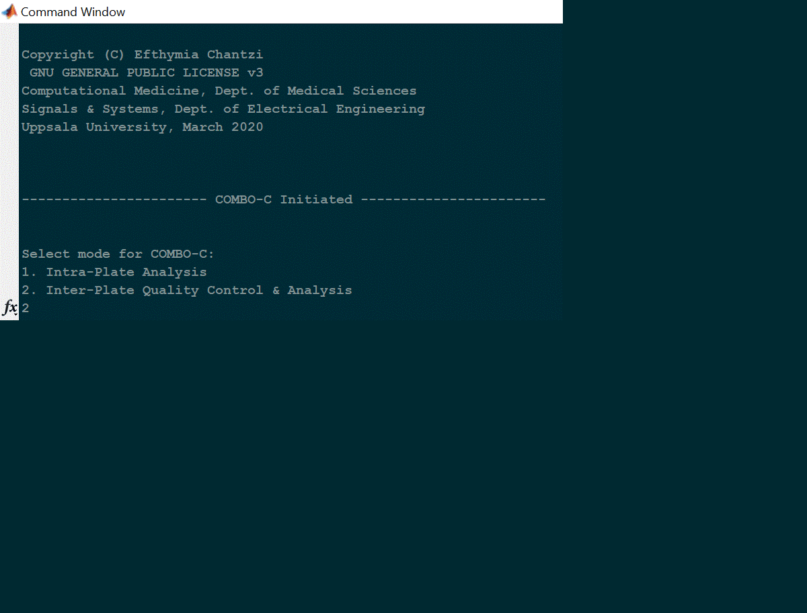

# COMBO-C
In order to run COMBO-C, follow the instructions below:

1. Right-click on the Windows executable file "COMBO_C.exe" and choose "Run as Administrator".
Alternatively, you can open a windows command prompt as an administrator, navigate to the path where
"COMBO-C.exe" is saved and run the command: 

```
> COMBO_C.exe
```

2. The next two short animations (follow along) show how to deploy COMBO-C using data from the exhaustive CUSP9 
study. In particular, the first animation shows how to perform intra-plate analysis, meaning time evolving cell 
growth/confluence quantification and visualization using the phase-contrast live-cell imaging data from one
replicate plate. The second animation shows how to perform inter-plate quality control, analysis and visualization,
meaning merging all replicate results obtained from running the intra-plate analysis from above for all replicate
plates. 

## Intra-plate analysis
 See also [COMBO_C_Intra_Plate_PDF](./COMBO_C_IntraPlate.pdf) for a PDF guide including all print out results from the command line. 
 
 
 
 
 ## Inter-plate analysis
  See also [COMBO_C_Intra_Plate_PDF](./COMBO_C_InterPlate.pdf) for a PDF guide including all print out results from the command line.
 
 
