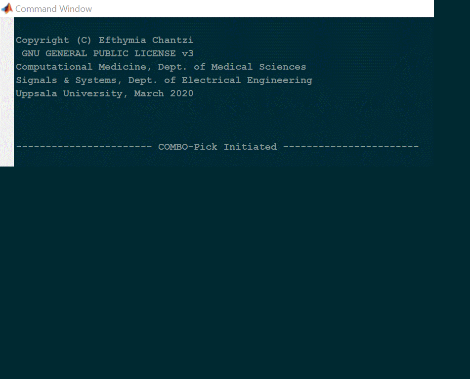
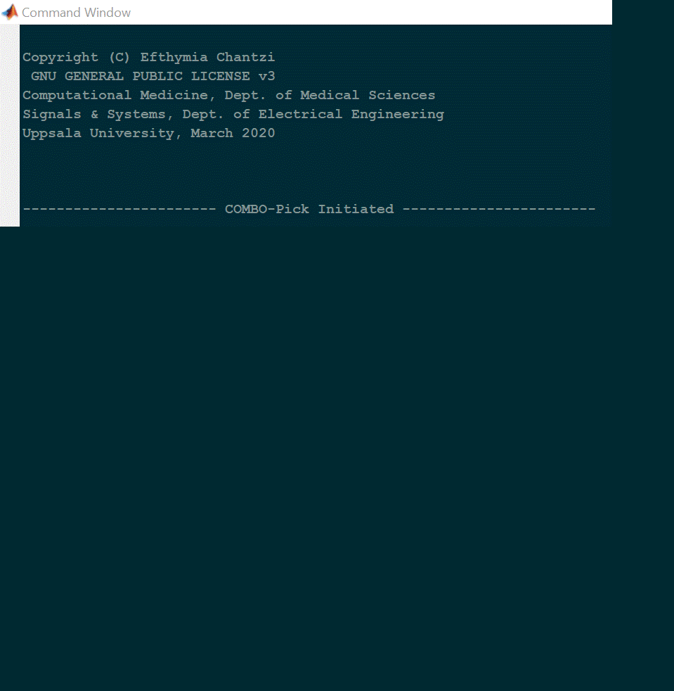

# COMBO-Pick
In order to run COMBO-Pick, follow the instructions below:

1. Right-click on the Windows executable file "COMBO_Pick.exe" and choose "Run as Administrator".
Alternatively, you can open a windows command prompt as an administrator, navigate to the path where
"COMBO-Pick.exe" is saved and run the command: 

```
> COMBO_Pick.exe
```

2. The two following short animations show how to deploy COMBO-Pick. In the first case, the user
defined specification file requests the exhaustive CUSP9 experiment, which does not fit in one 384-well
plate and thus, COMBO-Pick suggests an alternative solution by splitting the design in more than one plates.
In the second case, the user-defined specification file is adjusted to comply with the alternative solution
suggested by COMBO-Pick and is successfully deployed. 

 ## Split infeasible design
 
 
 
 
 ## Employ feasible design
 
 
 
 The results are saved as .xlsx files under \Results\COMBO-Mine in the directory that you set up in the begining. 


